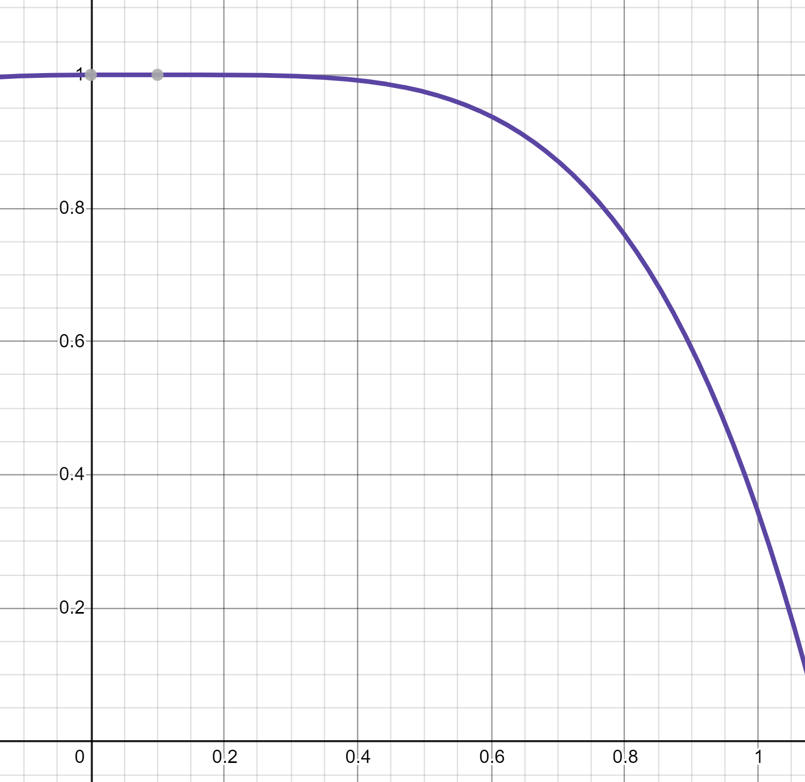

# Group 42 Negotiation Assignment

## Glossary

* SAOP: each agent can only respond to the most recent offer in its own turn. The turn taking sequences are predefined.

## Description of components

### Bidding Strategy

f(t)= 1 - (t - 0.1)^a with a = 4

## FAQ

### How to debug the party in Intellij?

1. Clone the simplerunner repo and import it in Intellij
2. Open 'Project Structure' dialog, navi to 'modules' section and add the party repo as a module of the Project.
    * Choose 'Import Module' 
        
    * Find the party directory and import it as an external model
        
    * Intellij should recognise and add the newly added module as a dependency when the POM is configured correctly.
3. Run the simplerunner in debug mode, it will stop at the bps set in the party module.
   
### How to use BOA as a dependency?

1. install (copy and paste) the folder [/boa](jars) into your local maven .m2 repository. 
 * For windows user, .m2 should be under the path C:/Users/\<your user name\>/.m2
 * for Linux/Mac users, use find command to locate the .m2 directory

2. Implement the bidding strategy, acceptance strategy and opponent modelling by inherit from 
corresponding interfaces BiddingStrategy, AcceptanceStrategy and OpponentModel.
   * Note here: BiddingStrategy and AcceptanceStrategy interface exist in the BOA repository,
    you can access it by importing from geniusweb.boa.XXXX; OpponentModel exists in the Opponentmodel
     repository, access it by importing from geniusweb.opponentmodel.XXXX.
3. return the strategy objects in the methods getOpponentModel, getBiddingStrategy,
   getAccceptanceStrategy in the Group42Party class.
   

### How does the SOAP works on the object level?

1. First party's lastbid == null, so she will make an offer by send an Offer obejct which is a derived
class of Action.
2. The Action is sent via ConnectionEnd's send() method. ConnectionEnd is an interface which is inherited
by ProtocolToPartyConn interface.
3. The SAOPState class, of which is a field of SOAP object, contains a list of ProtocolToPartyConns for each of the parties.
4. The Action send in step 2 is wrapped in an ActionDone object and broadcast to all ProtocolToPartyConns by SOAP object.
5. Both parties at this time receive an ActionDone info. 
6. SOAP then will determine whether this is the final round. If not, it calls nextTurn and send a YourTurn info to 
the corresponding party.
7. The party who receives the YourTurn info, make her next action then. 